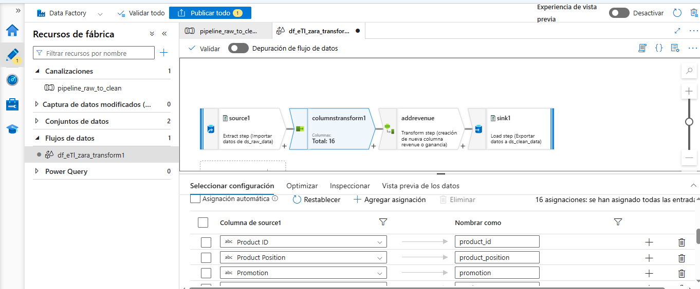
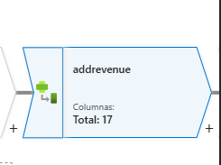
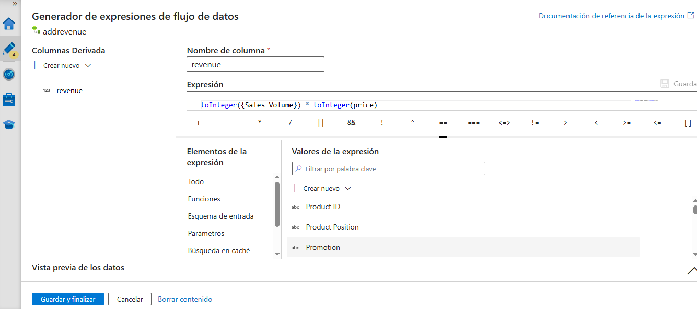
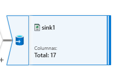
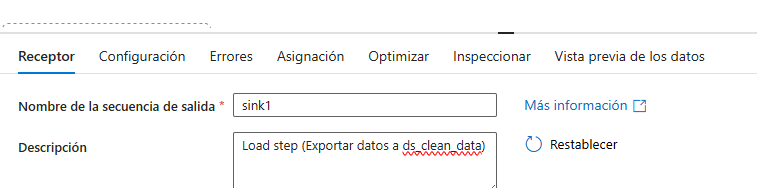

# Pipeline ETL ZARA en ADF: Documentación de Data Flow 🎯

El documento a continuación describe en detalle el flujo de transformación (*Mapping Data Flow*) implementado dentro de ADF Studio para el proyecto ETL de datos de ventas  de Zara. 

El objetivo principal es mostrar cómo a través de configuraciones visuales y un poco codificadas, se limpian, tipifican y enriquecen los datos antes de almacenarlos en una zona limpia (`clean-zone`)

---

##  Esquema general del Data Flow 🔦
#
```plaintext
source1 → columnstransform1 → addcolumn → sink1
```

## source1 📂
- Gracias a la actividad `Source`, se realiza la recolección de datos del contenedor `raw-zone` de Azure Blob Storage


## `columnstransform1` ✔
- Gracias a la actividad `Select`, se realiza la transformación de columnas, tipificando uniformemente el nombre de las mismas- 




## `addcolumn` ♻
- Gracias a la actividad `Derived Column`, se realiza la cración y el cálculo de la nueva columna derivada de `price` y `sales_volume`




## sink1 📦
- Gracias a la actividad `Sink`, se realiza la configuración para recibir y almacenar esta nueva información ahora mas limpia y con mas potencial de información. 




#
#
#### _Autor: Esteban Parrado_
