# Pipeline ETL ZARA en ADF: Descripción 🔁
#
#
## Objetivo del flujo

El Pipeline a continuación tiene como objetivo simular un proceso de transformación de datos de ventas utilizando Azure Data Factory, moviendo los datos desde un almacenamiento Data Lake, con Azure Blob Storage `raw-zone` hacia una zona limpia `clean-zone`, a través de un flujo de transformación visual (*Mapping Data Flow*) en ADF Studio.
#
---

## Elementos del Pipeline 🛠

### Origen (`source1`) 📂
- Conectado a un archivo `.csv` almacenado en Azure Blob Storage (`raw-zone`).
- Dataset: `zara_sales_june.csv`
- Estructura: columnas como `product_id`, `product_name`, `price`, `sales_volume`...

### Selección (`columnstransform1`) ✔
- Se realiza la selección de campos a utilizar desde source1
- Se relizan los cambios de tipificación de los campos.
- Este proceso permite estandarizar y mejorar la estructura de los datos.

### Transformación (`addcolumn`) ♻
- Se añade una nueva columna calculada derivada o calculada
 ```revenue = price * sales_volume```
- Esta operación permite simular una métrica clave de negocio

### Destino (`sink1`) 📦
- Se determina un nombre para el archivo limpio resultante, y se almacena en el         contenedor `clean-zone` de Azure Blob Storage.
- Formato de salida: `.csv` delimitado por punto y coma `;`
- Ahora el archivo contiene los mismos registros de entrada, pero con una mejor calidad en sus columnas y su aportación informativa gracias a la nueva columna `revenue`.

---

## Arquitectura visual del flujo 🗺
#

```plaintext
                        Azure Blob Storage (raw-zone)
                                     ↓
                                  source1
                                     ↓
                             columnstransfrom1
                                     ↓
                                 addcolumn
                                     ↓
                                   sink1
                                     ↓
                           Azure Blob Storage (clean)
```
---
# Paso a paso 🧗‍♂️
Una vez se tenga la cuenta azure debidamente activa, con los servicios necesarios, los 2 recursos creados: `almacenamiento blob` , `azure data factory (ADF)`, una cuenta de almacenamiento y una instancia de ADF creadas, se puede proceder con los siguientes pasos:

## 1. Creación de contenedores

Gracias al servicio `Azure Blob Storage`, tenemos la posibilidad de crear un almacenamiento de datos del tipo Data Lake, en cuál crearemos un contenedor `raw-zone` y otro `clean-zone`, este último para una vez tengamos la información lista, poder acceder a ella.

También, se procederá a cargar de manera manual, el archivo csv en la raw-zone.

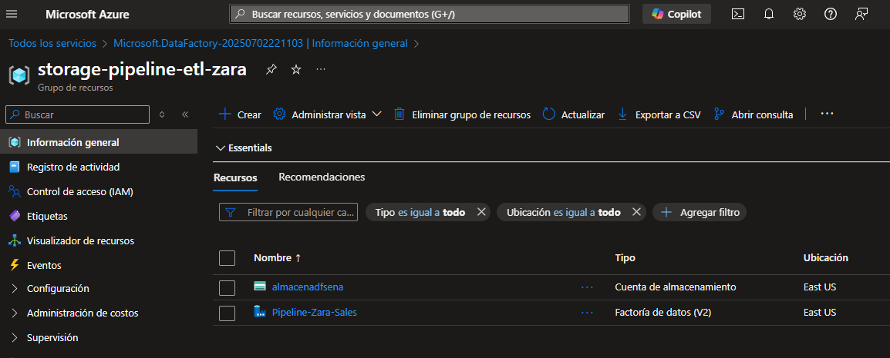
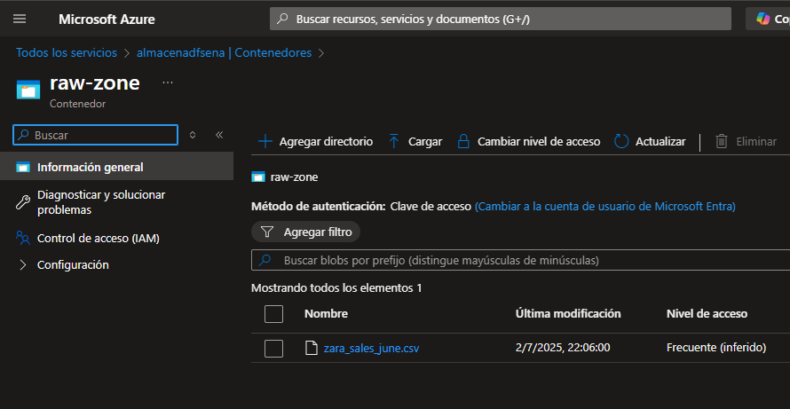
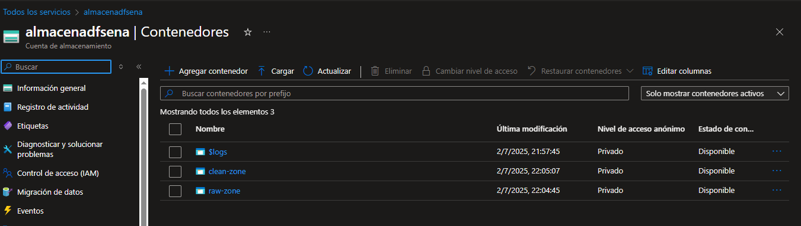

## 2. Creación de Servicios Vinculados

Se accede al Estudio de ADF, y allí en el apartado de `Administrar`, se agrega un nuevo servicio vinculado, donde haremos una conexión hacia la cuenta de almacenamiento o servicio de Azure Blob Storage, de esta manera, podemos trabajar con la data que allí se almacena, desde nuestro recurso ADF.

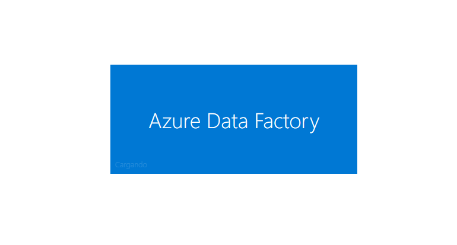
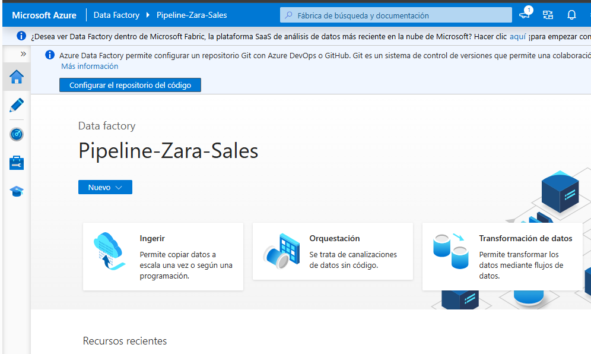


## 3.Creación de Datasets dentro de ADF

En la sección de `Autor`, se selecciona la opción de crear un nuevo Dataset a partir de nuestro servicio vinculado anteriormente `Azure Blob Storage`, se selecciona el formato para archivos, en este caso `DelimitedText` y se configura el resto de parámetros, nombre: ds-raw-data. Ojo!, el delimitador debe estar con `;`. Repetir el mismo proceso pero ahora con el Dataset de almacenamiento limpio: `ds-clean-data`.


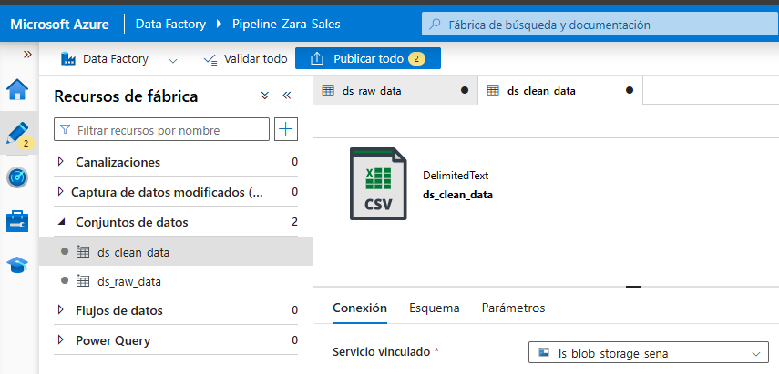
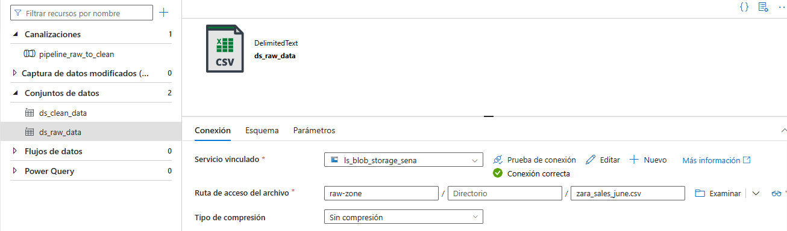
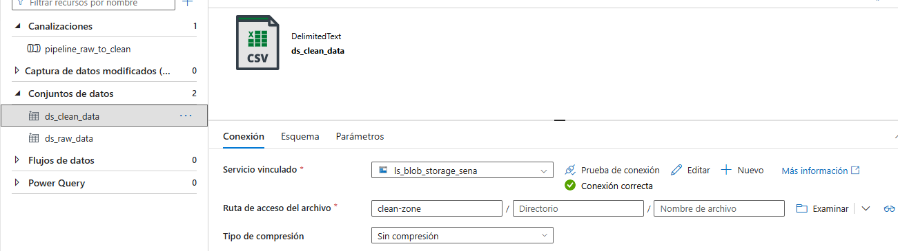

## 4.Creación de Flujo de datos

[Leer documentación completa de Flujo de datos ADF](dataflow_description.md)
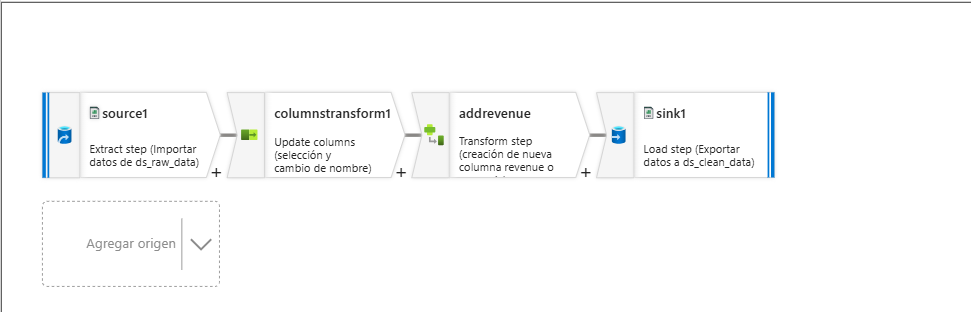

## 5.Creación de Pipeline o Canalizador

En la misma sección `Autor`, se selecciona el recurso de fábrica `Canalizaciones` y se crea una `Nueva Canalización`, una vez creada, la seleccionaremos y en el panel de actividades seleccionaremos `Mover y Transformar` > `Flujo de datos`, allí configuraremos el nuevo flujo de datos que hemos creado y el resto de parámetros opcionales.


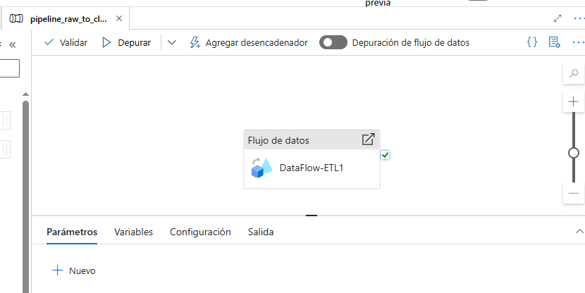


## 6.Realizar Debug y Publicación

Una Vez realizados todos los pasos, procederemos a Depurar, Validar y Publicar los cambios de ADF, 

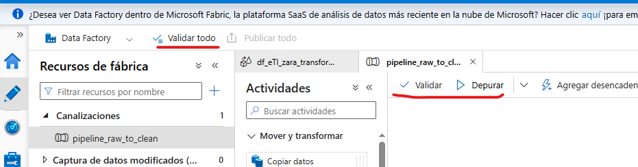


## 7.Ejecución (Desencadenador)
Una vez se haya validado y publicado, procedemos a ejecutar el pipeline manualmente, de la siguiente manera `Pipeline Creado` > `Agregar Desencadenador` > `Desencadenar Ahora`. El Pipeline se ejecutará, todo su proceso se observará en el en el side panel, apartado de `Monitoreo`. 

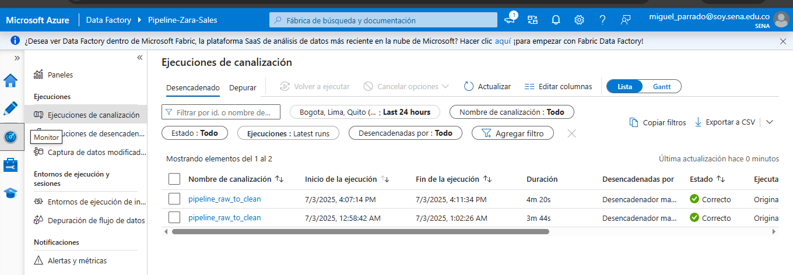
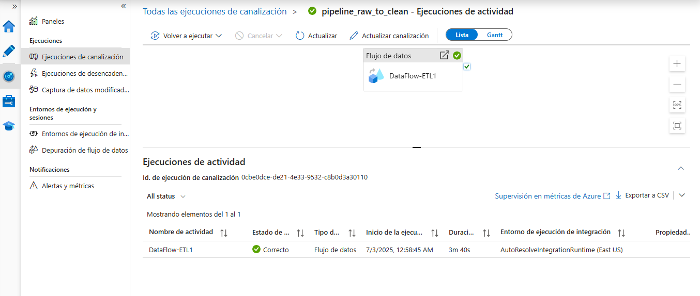


## 8.Validación 

Una vez la ejecución haya finalizado sin problemas, podremos validar yendo nuevamente al recurso de almacenamiento, cuenta de almacenamiento, y allí, `clean-zone` , validamos y procedemos a hacer los análisis necesarios. 

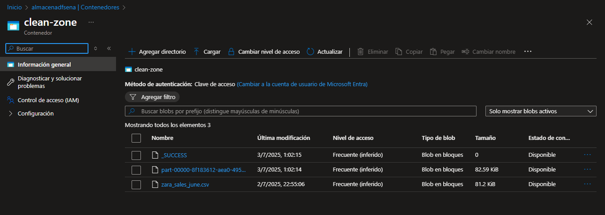

#
#
#### _Autor: Esteban Parrado_
